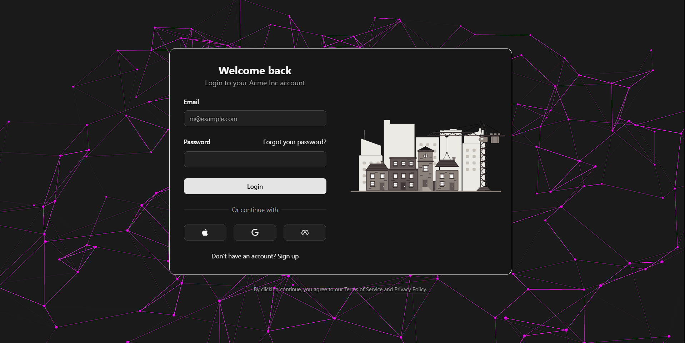

# 🧱 Contractor Dashboard

A sleek and powerful dashboard that allows contractors to manage clients and track project progress — complete with daily updates, image uploads, and a mobile-friendly interface.

 <!-- Replace with your actual screenshot path -->

---

## ✨ Features

- 🔐 **Supabase Authentication** – Secure login for contractors
- 👥 **Client Management** – View client list and detailed information
- 📆 **Progress Timeline** – Add daily work logs with summaries, details & image galleries
- 🖼️ **Image Uploads** – Upload multiple images per update
- 📱 **Responsive UI** – Fully mobile-friendly and modern design with Tailwind CSS
- 🔁 **Real-Time Updates** – Newly added progress appears instantly

---

## 🚀 Tech Stack

| Frontend        | Backend         | Database        | UI Components    |
|-----------------|------------------|------------------|------------------|
| React (Next.js) | Supabase (Auth + API) | PostgreSQL (Supabase) | Tailwind CSS + Radix UI + Lucide Icons |

---

## 🛠️ Setup & Installation

1. **Clone the repository**
   ```bash
   git clone https://github.com/renaoch/privateProject.git
   cd 
